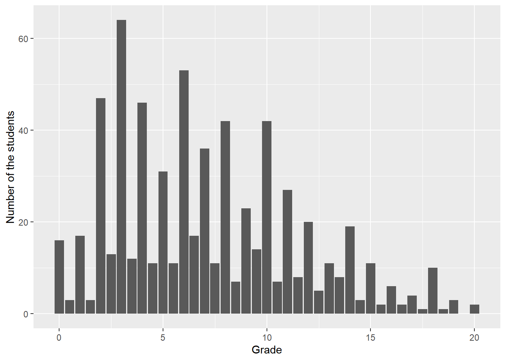
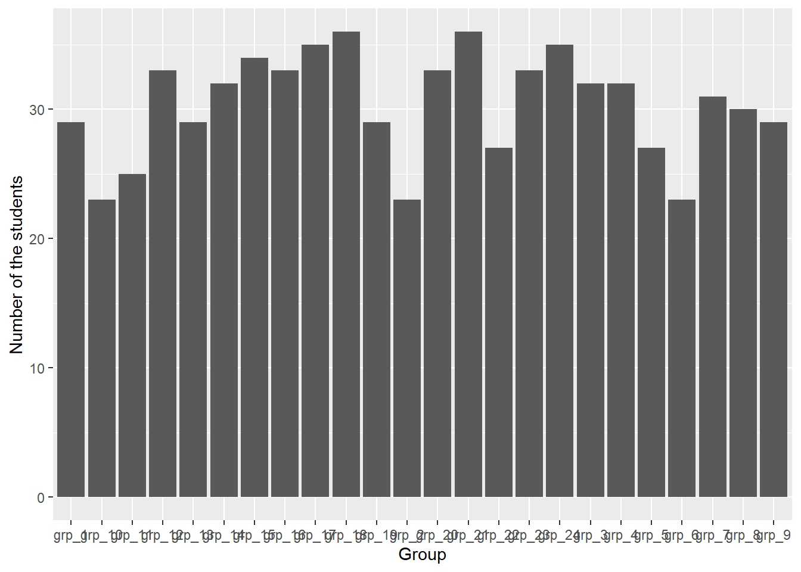
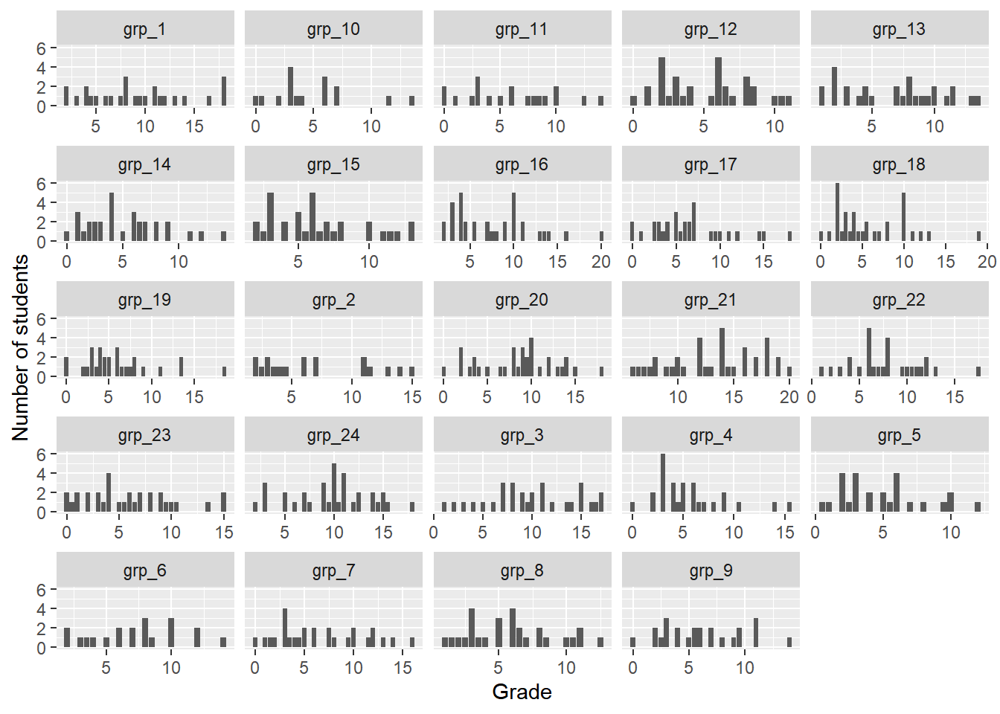
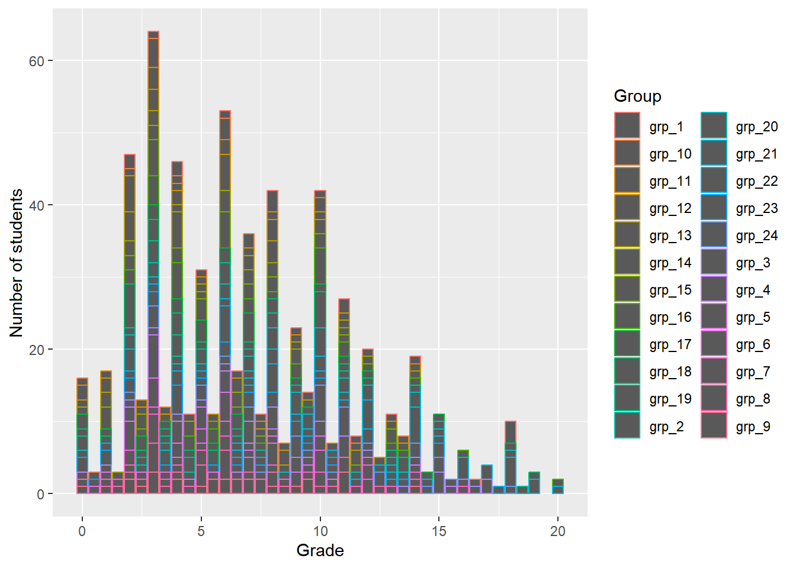
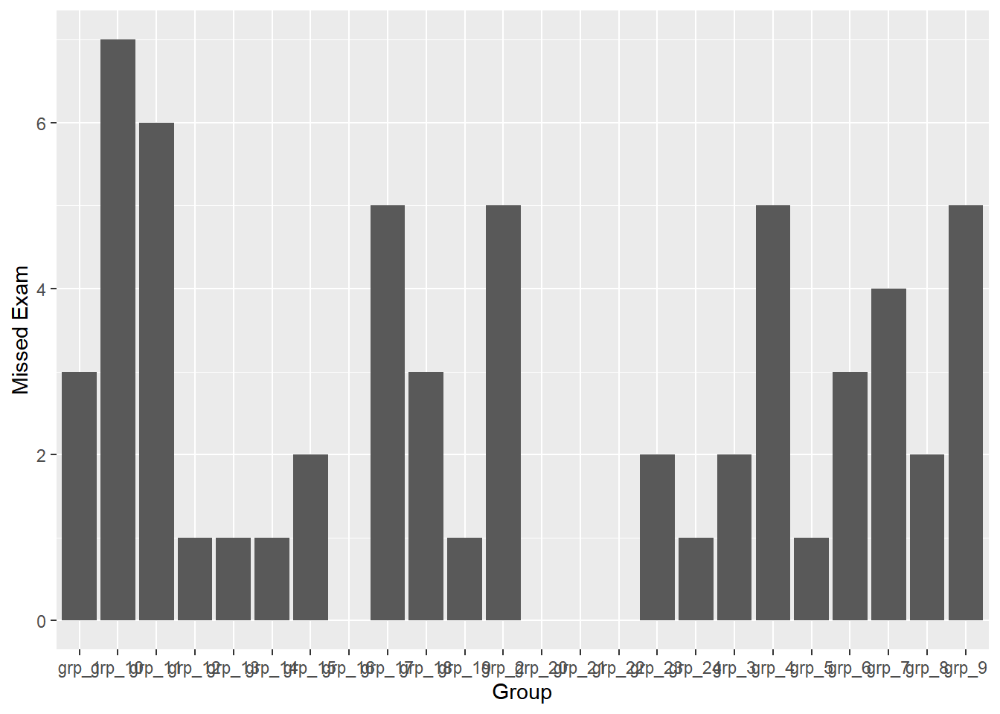
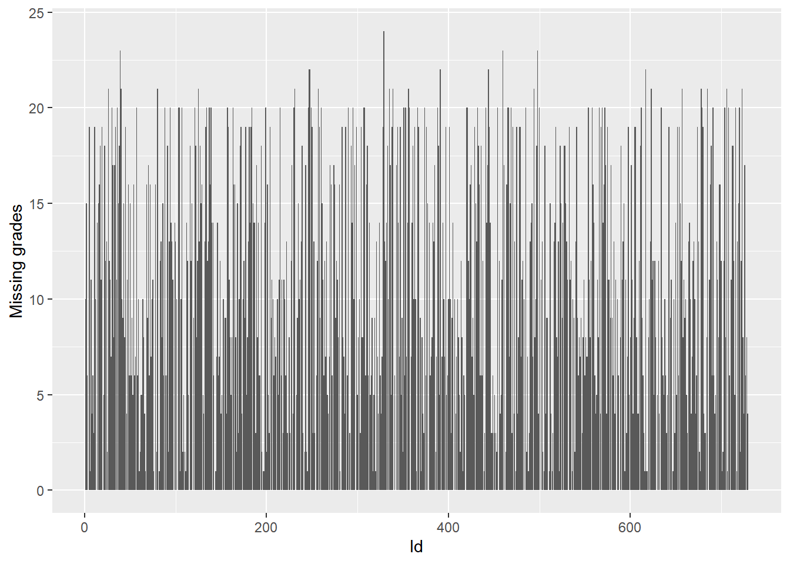
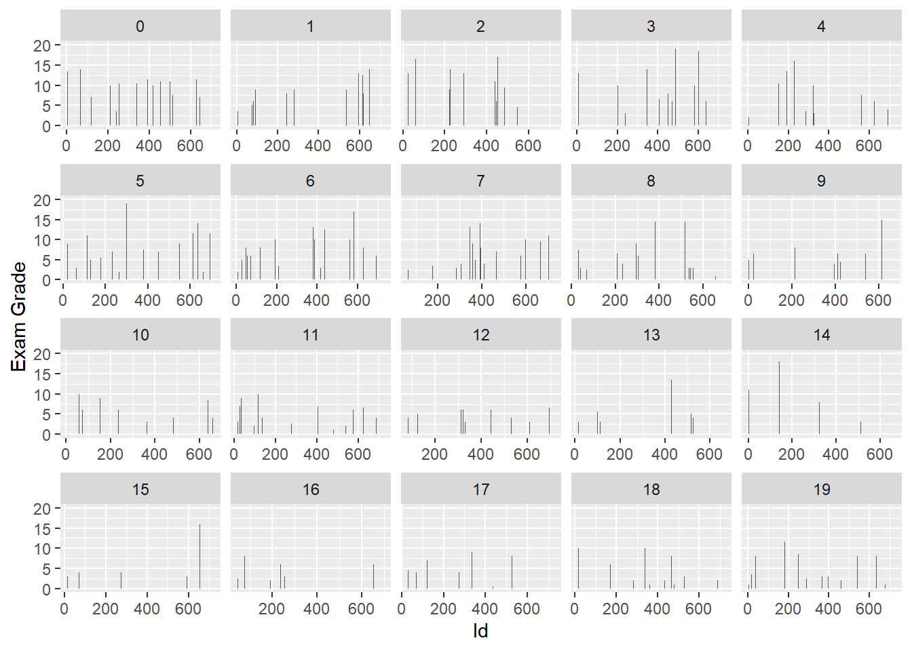
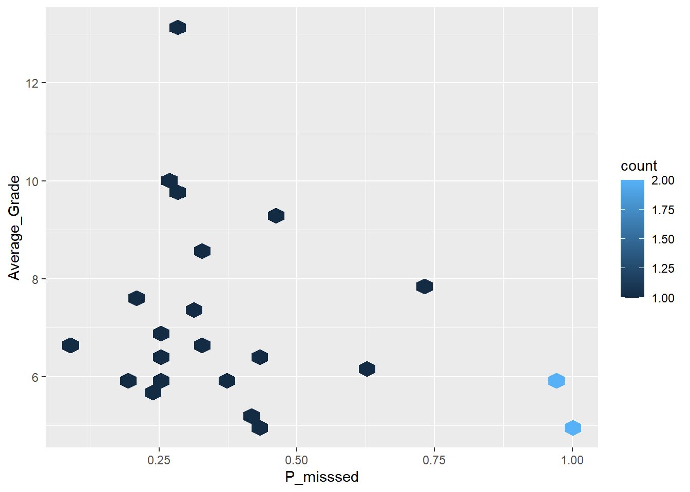

::: {.cell}

```{.r .cell-code}
here::i_am("r-101-grade-analysis.Rproj")
library(here)
library(vroom)
library(dplyr)
library(tidyr)
library(ggplot2)
library(stringr)
```
:::


## Exercise 1


::: {.cell}

```{.r .cell-code}
grades <- vroom(here("grades.csv"))
```
:::


## Exercise2


::: {.cell}

```{.r .cell-code}
T1 <- grades |>
  summarise(min_Grade=min(Exam,na.rm=TRUE),
            max_Grade=max(Exam,na.rm=TRUE),
            mean_Grade=mean(Exam,na.rm=TRUE),
            median_Grade=median(Exam,na.rm=TRUE))
knitr::kable(T1)
```

::: {.cell-output-display}
| min_Grade| max_Grade| mean_Grade| median_Grade|
|---------:|---------:|----------:|------------:|
|         0|        20|   7.148729|          6.5|
:::
:::


## Exercise 3


::: {.cell}

```{.r .cell-code}
N <- sum(is.na(grades$Exam))
```
:::

The number of students who did not take the final exam is  60.

## Exercise 4

::: {.cell}

```{.r .cell-code}
ggplot(grades, aes(x = Exam)) +
  geom_bar()+
  xlab("Grade") +
  ylab("Number of the students")
```

::: {.cell-output-display}
{width=672}
:::
:::


## Exercise 5

::: {.cell}

```{.r .cell-code}
T2 <- grades |>
  group_by(Group) |>
  summarise(number=n())
knitr::kable(T2)
```

::: {.cell-output-display}
|Group  | number|
|:------|------:|
|grp_1  |     29|
|grp_10 |     23|
|grp_11 |     25|
|grp_12 |     33|
|grp_13 |     29|
|grp_14 |     32|
|grp_15 |     34|
|grp_16 |     33|
|grp_17 |     35|
|grp_18 |     36|
|grp_19 |     29|
|grp_2  |     23|
|grp_20 |     33|
|grp_21 |     36|
|grp_22 |     27|
|grp_23 |     33|
|grp_24 |     35|
|grp_3  |     32|
|grp_4  |     32|
|grp_5  |     27|
|grp_6  |     23|
|grp_7  |     31|
|grp_8  |     30|
|grp_9  |     29|
:::
:::


## Exercise 6

::: {.cell}

```{.r .cell-code}
ggplot(grades, aes(x = Group)) +
  geom_bar()+
  xlab("Group") +
  ylab("Number of the students")
```

::: {.cell-output-display}
{width=672}
:::
:::


## Exercise 7

::: {.cell}

```{.r .cell-code}
ggplot(grades, aes(x = Exam)) +
  geom_bar()+
  facet_wrap(vars(Group),scales = "free_x")+
  scale_x_continuous(breaks = c(0,5,10,15,20))+
  xlab("Grade")+
  ylab("Number of students")
```

::: {.cell-output-display}
{width=672}
:::
:::

::: {.cell}

```{.r .cell-code}
ggplot(grades, aes(x = Exam, color=Group)) +
  geom_bar()+
  scale_x_continuous(breaks = c(0,5,10,15,20))+
  xlab("Grade")+
  ylab("Number of students")
```

::: {.cell-output-display}
{width=672}
:::
:::


## Exercise 8

::: {.cell}

```{.r .cell-code}
T3 <- grades |> 
    group_by(`Group`) |>
    summarize(number = sum(is.na(Exam)))
```
:::


## Exercise 9

::: {.cell}

```{.r .cell-code}
ggplot(T3, aes(x = Group, y = number)) +
  geom_col()+
  xlab("Group")+
  ylab("Missed Exam")
```

::: {.cell-output-display}
{width=672}
:::
:::


## Exercise 10

::: {.cell}

```{.r .cell-code}
options(digits=3)
T4 <- grades |>
  pivot_longer(!Id & !Group,names_to = "name", values_to = "Value")
```
:::


## Exercise 11

::: {.cell}

```{.r .cell-code}
T5 <- T4 |> 
    group_by(`Id`) |>
    summarize(missing_grades = sum(is.na(Value)))
```
:::


## Exercise 12

::: {.cell}

```{.r .cell-code}
ggplot(T5, aes(x = Id, y = missing_grades)) +
  geom_col()+
  xlab("Id")+
  ylab("Missing grades")
```

::: {.cell-output-display}
{width=672}
:::
:::


## Exercise 13

::: {.cell}

```{.r .cell-code}
T6 <- T4 |> 
    filter(str_starts(name,"Exam")) |>
    group_by(Group) |>  
    summarise(n = sum(is.na(Value)))
knitr::kable(T6)
```

::: {.cell-output-display}
|Group  |  n|
|:------|--:|
|grp_1  |  3|
|grp_10 |  7|
|grp_11 |  6|
|grp_12 |  1|
|grp_13 |  1|
|grp_14 |  1|
|grp_15 |  2|
|grp_16 |  0|
|grp_17 |  5|
|grp_18 |  3|
|grp_19 |  1|
|grp_2  |  5|
|grp_20 |  0|
|grp_21 |  0|
|grp_22 |  0|
|grp_23 |  2|
|grp_24 |  1|
|grp_3  |  2|
|grp_4  |  5|
|grp_5  |  1|
|grp_6  |  3|
|grp_7  |  4|
|grp_8  |  2|
|grp_9  |  5|
:::
:::


## Exercise 14

::: {.cell}

```{.r .cell-code}
T7 <- T4 |> 
    filter(str_starts(name,"Online_MCQ_")) |>
    group_by(`Id`) |>
    summarize(missing_online_grades = sum(is.na(Value)))
```
:::


## Exercise 15

::: {.cell}

```{.r .cell-code}
T8 <- inner_join(T7,grades,by="Id")
ggplot(T8, aes(x = Exam)) +
  geom_bar()+
  facet_wrap(vars(missing_online_grades), scales = "free_y")+
  xlab("Exam Grade")+
  ylab("Number")
```

::: {.cell-output-display}
{width=672}
:::
:::


## Exercise 16

::: {.cell}

```{.r .cell-code}
T9 <- T4 |>
  filter(str_starts(name,"MCQ_")) |>
  group_by(`Id`) |>
  summarize(Missed = isTRUE(sum(is.na(Value))>=1))
```
:::


## Exercise 17

::: {.cell}

```{.r .cell-code}
T10 <- inner_join(T9,grades,by="Id") |>
  count(Group, Missed) |>
  group_by(Group) |>
  mutate(P_misssed=n/sum(n)) |>
  ungroup() |>
  filter(Missed=="TRUE") |>
  select(Group,P_misssed)
```
:::


## Exercise 18

::: {.cell}

```{.r .cell-code}
T11 <- grades |>
  group_by(Group) |>
  summarise(Average_Grade=mean(Exam,na.rm=TRUE)) |>
  inner_join(T10,by="Group")
```
:::

::: {.cell}

```{.r .cell-code}
ggplot(T11, aes(x=P_misssed,y=Average_Grade)) +
geom_hex()
```

::: {.cell-output-display}
{width=672}
:::
:::
