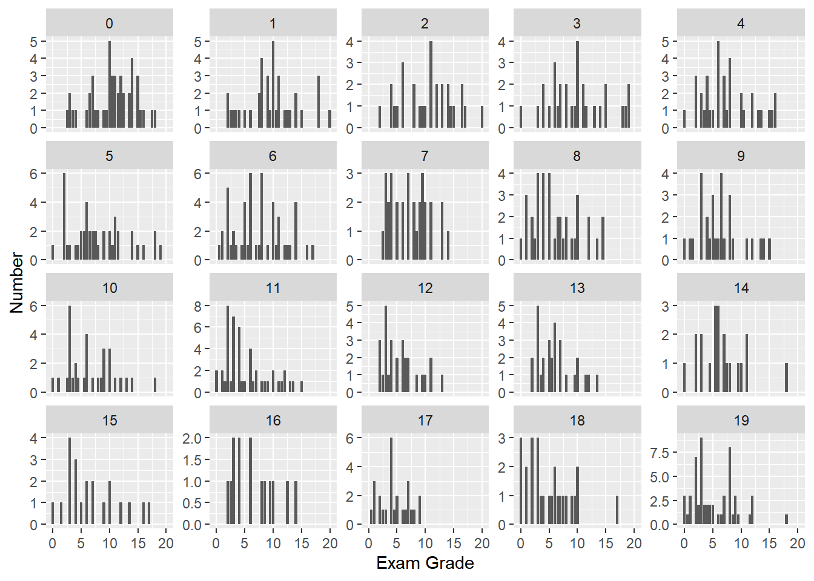

::: {.cell}

```{.r .cell-code}
here::i_am("r-101-grade-analysis.Rproj")
library(here)
library(vroom)
library(dplyr)
library(tidyr)
library(ggplot2)
library(stringr)
```
:::


## Exercise 1


::: {.cell}

```{.r .cell-code}
grades <- vroom(here("grades.csv"))
```
:::


## Exercise2


::: {.cell}

```{.r .cell-code}
T1 <- grades |>
  summarise(min_Grade=min(Exam,na.rm=TRUE),
            max_Grade=max(Exam,na.rm=TRUE),
            mean_Grade=mean(Exam,na.rm=TRUE),
            median_Grade=median(Exam,na.rm=TRUE))
knitr::kable(T1)
```

::: {.cell-output-display}
| min_Grade| max_Grade| mean_Grade| median_Grade|
|---------:|---------:|----------:|------------:|
|         0|        20|   7.148729|          6.5|
:::
:::


## Exercise 3


::: {.cell}

```{.r .cell-code}
N <- sum(is.na(grades$Exam))
```
:::

The number of students who did not take the final exam is  60.

## Exercise 4

::: {.cell}

```{.r .cell-code}
ggplot(grades, aes(x = Exam)) +
  geom_bar()+
  xlab("Grade") +
  ylab("Number of the students")
```

::: {.cell-output-display}
{width=672}
:::
:::


## Exercise 5

::: {.cell}

```{.r .cell-code}
T2 <- grades |>
  group_by(Group) |>
  summarise(number=n())
knitr::kable(T2)
```

::: {.cell-output-display}
|Group  | number|
|:------|------:|
|grp_1  |     29|
|grp_10 |     23|
|grp_11 |     25|
|grp_12 |     33|
|grp_13 |     29|
|grp_14 |     32|
|grp_15 |     34|
|grp_16 |     33|
|grp_17 |     35|
|grp_18 |     36|
|grp_19 |     29|
|grp_2  |     23|
|grp_20 |     33|
|grp_21 |     36|
|grp_22 |     27|
|grp_23 |     33|
|grp_24 |     35|
|grp_3  |     32|
|grp_4  |     32|
|grp_5  |     27|
|grp_6  |     23|
|grp_7  |     31|
|grp_8  |     30|
|grp_9  |     29|
:::
:::


## Exercise 6

::: {.cell}

```{.r .cell-code}
ggplot(grades, aes(x = Group)) +
  geom_bar()+
  xlab("Group") +
  ylab("Number of the students")
```

::: {.cell-output-display}
{width=672}
:::
:::


## Exercise 7

::: {.cell}

```{.r .cell-code}
ggplot(grades, aes(x = Exam)) +
  geom_bar()+
  facet_wrap(vars(Group),scales = "free_x")+
  scale_x_continuous(breaks = c(0,5,10,15,20))+
  xlab("Grade")+
  ylab("Number of students")
```

::: {.cell-output-display}
{width=672}
:::
:::

::: {.cell}

```{.r .cell-code}
ggplot(grades, aes(x = Exam, color=Group)) +
  geom_bar()+
  scale_x_continuous(breaks = c(0,5,10,15,20))+
  xlab("Grade")+
  ylab("Number of students")
```

::: {.cell-output-display}
{width=672}
:::
:::


## Exercise 8

::: {.cell}

```{.r .cell-code}
T3 <- grades |> 
    group_by(`Group`) |>
    summarize(number = sum(is.na(Exam)))
knitr::kable(T3)
```

::: {.cell-output-display}
|Group  | number|
|:------|------:|
|grp_1  |      3|
|grp_10 |      7|
|grp_11 |      6|
|grp_12 |      1|
|grp_13 |      1|
|grp_14 |      1|
|grp_15 |      2|
|grp_16 |      0|
|grp_17 |      5|
|grp_18 |      3|
|grp_19 |      1|
|grp_2  |      5|
|grp_20 |      0|
|grp_21 |      0|
|grp_22 |      0|
|grp_23 |      2|
|grp_24 |      1|
|grp_3  |      2|
|grp_4  |      5|
|grp_5  |      1|
|grp_6  |      3|
|grp_7  |      4|
|grp_8  |      2|
|grp_9  |      5|
:::
:::


## Exercise 9

::: {.cell}

```{.r .cell-code}
ggplot(T3, aes(x = Group, y = number)) +
  geom_col()+
  xlab("Group")+
  ylab("Missed Exam")
```

::: {.cell-output-display}
{width=672}
:::
:::


## Exercise 10

::: {.cell}

```{.r .cell-code}
options(digits=3)
T4 <- grades |>
  pivot_longer(!Id & !Group,names_to = "name", values_to = "Value")
```
:::


## Exercise 11

::: {.cell}

```{.r .cell-code}
T5 <- T4 |> 
    group_by(`Id`) |>
    summarize(missing_grades = sum(is.na(Value)))
```
:::


## Exercise 12

::: {.cell}

```{.r .cell-code}
ggplot(T5, aes(x = Id, y = missing_grades)) +
  geom_col()+
  xlab("Id")+
  ylab("Missing grades")
```

::: {.cell-output-display}
{width=672}
:::
:::


## Exercise 13

::: {.cell}

```{.r .cell-code}
T6 <- T4 |> 
    filter(str_starts(name,"Exam")) |>
    group_by(Group) |>  
    summarise(n = sum(is.na(Value)))
knitr::kable(T6)
```

::: {.cell-output-display}
|Group  |  n|
|:------|--:|
|grp_1  |  3|
|grp_10 |  7|
|grp_11 |  6|
|grp_12 |  1|
|grp_13 |  1|
|grp_14 |  1|
|grp_15 |  2|
|grp_16 |  0|
|grp_17 |  5|
|grp_18 |  3|
|grp_19 |  1|
|grp_2  |  5|
|grp_20 |  0|
|grp_21 |  0|
|grp_22 |  0|
|grp_23 |  2|
|grp_24 |  1|
|grp_3  |  2|
|grp_4  |  5|
|grp_5  |  1|
|grp_6  |  3|
|grp_7  |  4|
|grp_8  |  2|
|grp_9  |  5|
:::
:::


## Exercise 14

::: {.cell}

```{.r .cell-code}
T7 <- T4 |> 
    filter(str_starts(name,"Online_MCQ_")) |>
    group_by(`Id`) |>
    summarize(missing_online_grades = sum(is.na(Value)))
```
:::


## Exercise 15

::: {.cell}

```{.r .cell-code}
T8 <- inner_join(T7,grades,by="Id")
ggplot(T8, aes(x = Exam)) +
  geom_bar()+
  facet_wrap(vars(missing_online_grades), scales = "free_y")+
  xlab("Exam Grade")+
  ylab("Number")
```

::: {.cell-output-display}
{width=672}
:::
:::


## Exercise 16

::: {.cell}

```{.r .cell-code}
T9 <- T4 |>
  filter(str_starts(name,"MCQ_")) |>
  group_by(`Id`) |>
  summarize(Missed = isTRUE(sum(is.na(Value))>=1))
knitr::kable(T9)
```

::: {.cell-output-display}
|  Id|Missed |
|---:|:------|
|   1|TRUE   |
|   2|TRUE   |
|   3|TRUE   |
|   4|FALSE  |
|   5|FALSE  |
|   6|FALSE  |
|   7|TRUE   |
|   8|TRUE   |
|   9|FALSE  |
|  10|FALSE  |
|  11|FALSE  |
|  12|FALSE  |
|  13|FALSE  |
|  14|TRUE   |
|  15|TRUE   |
|  16|TRUE   |
|  17|FALSE  |
|  18|FALSE  |
|  19|FALSE  |
|  20|FALSE  |
|  21|FALSE  |
|  22|FALSE  |
|  23|TRUE   |
|  24|TRUE   |
|  25|FALSE  |
|  26|TRUE   |
|  27|TRUE   |
|  28|FALSE  |
|  29|TRUE   |
|  30|FALSE  |
|  31|FALSE  |
|  32|FALSE  |
|  33|FALSE  |
|  34|TRUE   |
|  35|FALSE  |
|  36|FALSE  |
|  37|TRUE   |
|  38|FALSE  |
|  39|TRUE   |
|  40|TRUE   |
|  41|TRUE   |
|  42|TRUE   |
|  43|FALSE  |
|  44|FALSE  |
|  45|FALSE  |
|  46|FALSE  |
|  47|FALSE  |
|  48|FALSE  |
|  49|FALSE  |
|  50|TRUE   |
|  51|TRUE   |
|  52|FALSE  |
|  53|TRUE   |
|  54|TRUE   |
|  55|FALSE  |
|  56|TRUE   |
|  57|TRUE   |
|  58|FALSE  |
|  59|FALSE  |
|  60|FALSE  |
|  61|FALSE  |
|  62|FALSE  |
|  63|FALSE  |
|  64|FALSE  |
|  65|TRUE   |
|  66|TRUE   |
|  67|TRUE   |
|  68|TRUE   |
|  69|TRUE   |
|  70|FALSE  |
|  71|TRUE   |
|  72|TRUE   |
|  73|TRUE   |
|  74|FALSE  |
|  75|TRUE   |
|  76|FALSE  |
|  77|FALSE  |
|  78|FALSE  |
|  79|FALSE  |
|  80|TRUE   |
|  81|FALSE  |
|  82|FALSE  |
|  83|FALSE  |
|  84|FALSE  |
|  85|TRUE   |
|  86|TRUE   |
|  87|FALSE  |
|  88|TRUE   |
|  89|TRUE   |
|  90|TRUE   |
|  91|FALSE  |
|  92|TRUE   |
|  93|FALSE  |
|  94|FALSE  |
|  95|TRUE   |
|  96|FALSE  |
|  97|FALSE  |
|  98|FALSE  |
|  99|TRUE   |
| 100|FALSE  |
| 101|TRUE   |
| 102|FALSE  |
| 103|TRUE   |
| 104|FALSE  |
| 105|FALSE  |
| 106|TRUE   |
| 107|FALSE  |
| 108|FALSE  |
| 109|FALSE  |
| 110|TRUE   |
| 111|FALSE  |
| 112|TRUE   |
| 113|TRUE   |
| 114|FALSE  |
| 115|FALSE  |
| 116|TRUE   |
| 117|TRUE   |
| 118|TRUE   |
| 119|FALSE  |
| 120|TRUE   |
| 121|TRUE   |
| 122|TRUE   |
| 123|FALSE  |
| 124|FALSE  |
| 125|TRUE   |
| 126|TRUE   |
| 127|FALSE  |
| 128|FALSE  |
| 129|TRUE   |
| 130|FALSE  |
| 131|TRUE   |
| 132|FALSE  |
| 133|FALSE  |
| 134|TRUE   |
| 135|TRUE   |
| 136|TRUE   |
| 137|FALSE  |
| 138|FALSE  |
| 139|TRUE   |
| 140|FALSE  |
| 141|FALSE  |
| 142|TRUE   |
| 143|FALSE  |
| 144|FALSE  |
| 145|FALSE  |
| 146|FALSE  |
| 147|TRUE   |
| 148|TRUE   |
| 149|FALSE  |
| 150|TRUE   |
| 151|TRUE   |
| 152|FALSE  |
| 153|FALSE  |
| 154|TRUE   |
| 155|FALSE  |
| 156|FALSE  |
| 157|FALSE  |
| 158|FALSE  |
| 159|FALSE  |
| 160|FALSE  |
| 161|TRUE   |
| 162|TRUE   |
| 163|FALSE  |
| 164|FALSE  |
| 165|TRUE   |
| 166|FALSE  |
| 167|FALSE  |
| 168|TRUE   |
| 169|TRUE   |
| 170|FALSE  |
| 171|FALSE  |
| 172|FALSE  |
| 173|FALSE  |
| 174|TRUE   |
| 175|FALSE  |
| 176|TRUE   |
| 177|FALSE  |
| 178|FALSE  |
| 179|TRUE   |
| 180|FALSE  |
| 181|FALSE  |
| 182|FALSE  |
| 183|FALSE  |
| 184|TRUE   |
| 185|FALSE  |
| 186|FALSE  |
| 187|TRUE   |
| 188|TRUE   |
| 189|TRUE   |
| 190|TRUE   |
| 191|TRUE   |
| 192|TRUE   |
| 193|FALSE  |
| 194|TRUE   |
| 195|FALSE  |
| 196|FALSE  |
| 197|FALSE  |
| 198|TRUE   |
| 199|TRUE   |
| 200|TRUE   |
| 201|TRUE   |
| 202|FALSE  |
| 203|FALSE  |
| 204|TRUE   |
| 205|TRUE   |
| 206|TRUE   |
| 207|FALSE  |
| 208|FALSE  |
| 209|FALSE  |
| 210|TRUE   |
| 211|FALSE  |
| 212|TRUE   |
| 213|FALSE  |
| 214|TRUE   |
| 215|FALSE  |
| 216|TRUE   |
| 217|FALSE  |
| 218|FALSE  |
| 219|FALSE  |
| 220|FALSE  |
| 221|FALSE  |
| 222|TRUE   |
| 223|TRUE   |
| 224|FALSE  |
| 225|FALSE  |
| 226|TRUE   |
| 227|TRUE   |
| 228|FALSE  |
| 229|FALSE  |
| 230|FALSE  |
| 231|TRUE   |
| 232|FALSE  |
| 233|FALSE  |
| 234|TRUE   |
| 235|FALSE  |
| 236|FALSE  |
| 237|TRUE   |
| 238|TRUE   |
| 239|TRUE   |
| 240|FALSE  |
| 241|FALSE  |
| 242|FALSE  |
| 243|FALSE  |
| 244|FALSE  |
| 245|FALSE  |
| 246|FALSE  |
| 247|TRUE   |
| 248|TRUE   |
| 249|TRUE   |
| 250|FALSE  |
| 251|FALSE  |
| 252|TRUE   |
| 253|TRUE   |
| 254|FALSE  |
| 255|FALSE  |
| 256|TRUE   |
| 257|TRUE   |
| 258|FALSE  |
| 259|FALSE  |
| 260|FALSE  |
| 261|TRUE   |
| 262|TRUE   |
| 263|TRUE   |
| 264|FALSE  |
| 265|TRUE   |
| 266|TRUE   |
| 267|TRUE   |
| 268|FALSE  |
| 269|TRUE   |
| 270|FALSE  |
| 271|FALSE  |
| 272|FALSE  |
| 273|FALSE  |
| 274|FALSE  |
| 275|TRUE   |
| 276|TRUE   |
| 277|TRUE   |
| 278|FALSE  |
| 279|FALSE  |
| 280|TRUE   |
| 281|FALSE  |
| 282|FALSE  |
| 283|TRUE   |
| 284|TRUE   |
| 285|FALSE  |
| 286|FALSE  |
| 287|FALSE  |
| 288|FALSE  |
| 289|TRUE   |
| 290|TRUE   |
| 291|TRUE   |
| 292|TRUE   |
| 293|TRUE   |
| 294|TRUE   |
| 295|TRUE   |
| 296|TRUE   |
| 297|TRUE   |
| 298|FALSE  |
| 299|FALSE  |
| 300|FALSE  |
| 301|TRUE   |
| 302|TRUE   |
| 303|FALSE  |
| 304|FALSE  |
| 305|FALSE  |
| 306|TRUE   |
| 307|FALSE  |
| 308|FALSE  |
| 309|FALSE  |
| 310|TRUE   |
| 311|FALSE  |
| 312|TRUE   |
| 313|TRUE   |
| 314|FALSE  |
| 315|FALSE  |
| 316|TRUE   |
| 317|FALSE  |
| 318|FALSE  |
| 319|FALSE  |
| 320|FALSE  |
| 321|TRUE   |
| 322|TRUE   |
| 323|FALSE  |
| 324|FALSE  |
| 325|FALSE  |
| 326|FALSE  |
| 327|FALSE  |
| 328|FALSE  |
| 329|TRUE   |
| 330|TRUE   |
| 331|FALSE  |
| 332|TRUE   |
| 333|TRUE   |
| 334|FALSE  |
| 335|TRUE   |
| 336|FALSE  |
| 337|FALSE  |
| 338|TRUE   |
| 339|TRUE   |
| 340|FALSE  |
| 341|TRUE   |
| 342|FALSE  |
| 343|FALSE  |
| 344|TRUE   |
| 345|TRUE   |
| 346|FALSE  |
| 347|TRUE   |
| 348|TRUE   |
| 349|TRUE   |
| 350|TRUE   |
| 351|FALSE  |
| 352|TRUE   |
| 353|FALSE  |
| 354|FALSE  |
| 355|TRUE   |
| 356|TRUE   |
| 357|FALSE  |
| 358|FALSE  |
| 359|FALSE  |
| 360|TRUE   |
| 361|FALSE  |
| 362|FALSE  |
| 363|FALSE  |
| 364|FALSE  |
| 365|FALSE  |
| 366|TRUE   |
| 367|FALSE  |
| 368|FALSE  |
| 369|FALSE  |
| 370|FALSE  |
| 371|TRUE   |
| 372|FALSE  |
| 373|FALSE  |
| 374|TRUE   |
| 375|FALSE  |
| 376|FALSE  |
| 377|TRUE   |
| 378|FALSE  |
| 379|FALSE  |
| 380|TRUE   |
| 381|TRUE   |
| 382|FALSE  |
| 383|FALSE  |
| 384|TRUE   |
| 385|FALSE  |
| 386|FALSE  |
| 387|TRUE   |
| 388|FALSE  |
| 389|FALSE  |
| 390|FALSE  |
| 391|TRUE   |
| 392|FALSE  |
| 393|FALSE  |
| 394|FALSE  |
| 395|TRUE   |
| 396|FALSE  |
| 397|FALSE  |
| 398|TRUE   |
| 399|FALSE  |
| 400|TRUE   |
| 401|FALSE  |
| 402|FALSE  |
| 403|TRUE   |
| 404|TRUE   |
| 405|TRUE   |
| 406|FALSE  |
| 407|FALSE  |
| 408|TRUE   |
| 409|TRUE   |
| 410|TRUE   |
| 411|TRUE   |
| 412|TRUE   |
| 413|FALSE  |
| 414|TRUE   |
| 415|FALSE  |
| 416|FALSE  |
| 417|FALSE  |
| 418|FALSE  |
| 419|FALSE  |
| 420|FALSE  |
| 421|FALSE  |
| 422|FALSE  |
| 423|TRUE   |
| 424|TRUE   |
| 425|FALSE  |
| 426|TRUE   |
| 427|FALSE  |
| 428|TRUE   |
| 429|FALSE  |
| 430|TRUE   |
| 431|TRUE   |
| 432|TRUE   |
| 433|FALSE  |
| 434|TRUE   |
| 435|FALSE  |
| 436|TRUE   |
| 437|FALSE  |
| 438|TRUE   |
| 439|FALSE  |
| 440|TRUE   |
| 441|FALSE  |
| 442|TRUE   |
| 443|FALSE  |
| 444|TRUE   |
| 445|TRUE   |
| 446|TRUE   |
| 447|TRUE   |
| 448|TRUE   |
| 449|FALSE  |
| 450|FALSE  |
| 451|FALSE  |
| 452|FALSE  |
| 453|FALSE  |
| 454|TRUE   |
| 455|FALSE  |
| 456|TRUE   |
| 457|TRUE   |
| 458|TRUE   |
| 459|TRUE   |
| 460|TRUE   |
| 461|FALSE  |
| 462|FALSE  |
| 463|TRUE   |
| 464|FALSE  |
| 465|FALSE  |
| 466|TRUE   |
| 467|FALSE  |
| 468|TRUE   |
| 469|FALSE  |
| 470|FALSE  |
| 471|TRUE   |
| 472|TRUE   |
| 473|TRUE   |
| 474|FALSE  |
| 475|FALSE  |
| 476|FALSE  |
| 477|FALSE  |
| 478|FALSE  |
| 479|TRUE   |
| 480|FALSE  |
| 481|FALSE  |
| 482|FALSE  |
| 483|FALSE  |
| 484|FALSE  |
| 485|FALSE  |
| 486|FALSE  |
| 487|TRUE   |
| 488|FALSE  |
| 489|FALSE  |
| 490|TRUE   |
| 491|TRUE   |
| 492|TRUE   |
| 493|TRUE   |
| 494|TRUE   |
| 495|FALSE  |
| 496|FALSE  |
| 497|TRUE   |
| 498|TRUE   |
| 499|FALSE  |
| 500|TRUE   |
| 501|FALSE  |
| 502|TRUE   |
| 503|TRUE   |
| 504|TRUE   |
| 505|FALSE  |
| 506|FALSE  |
| 507|FALSE  |
| 508|FALSE  |
| 509|FALSE  |
| 510|FALSE  |
| 511|FALSE  |
| 512|TRUE   |
| 513|FALSE  |
| 514|TRUE   |
| 515|FALSE  |
| 516|FALSE  |
| 517|TRUE   |
| 518|FALSE  |
| 519|FALSE  |
| 520|TRUE   |
| 521|FALSE  |
| 522|TRUE   |
| 523|FALSE  |
| 524|TRUE   |
| 525|FALSE  |
| 526|TRUE   |
| 527|TRUE   |
| 528|FALSE  |
| 529|TRUE   |
| 530|TRUE   |
| 531|TRUE   |
| 532|FALSE  |
| 533|FALSE  |
| 534|FALSE  |
| 535|TRUE   |
| 536|FALSE  |
| 537|TRUE   |
| 538|FALSE  |
| 539|FALSE  |
| 540|TRUE   |
| 541|FALSE  |
| 542|FALSE  |
| 543|FALSE  |
| 544|FALSE  |
| 545|TRUE   |
| 546|TRUE   |
| 547|TRUE   |
| 548|FALSE  |
| 549|FALSE  |
| 550|TRUE   |
| 551|TRUE   |
| 552|TRUE   |
| 553|TRUE   |
| 554|FALSE  |
| 555|FALSE  |
| 556|FALSE  |
| 557|TRUE   |
| 558|TRUE   |
| 559|FALSE  |
| 560|FALSE  |
| 561|FALSE  |
| 562|FALSE  |
| 563|TRUE   |
| 564|TRUE   |
| 565|TRUE   |
| 566|FALSE  |
| 567|FALSE  |
| 568|TRUE   |
| 569|FALSE  |
| 570|FALSE  |
| 571|FALSE  |
| 572|TRUE   |
| 573|TRUE   |
| 574|TRUE   |
| 575|FALSE  |
| 576|FALSE  |
| 577|TRUE   |
| 578|TRUE   |
| 579|TRUE   |
| 580|FALSE  |
| 581|FALSE  |
| 582|TRUE   |
| 583|TRUE   |
| 584|TRUE   |
| 585|FALSE  |
| 586|TRUE   |
| 587|TRUE   |
| 588|FALSE  |
| 589|FALSE  |
| 590|TRUE   |
| 591|FALSE  |
| 592|FALSE  |
| 593|FALSE  |
| 594|TRUE   |
| 595|FALSE  |
| 596|TRUE   |
| 597|TRUE   |
| 598|FALSE  |
| 599|FALSE  |
| 600|TRUE   |
| 601|TRUE   |
| 602|TRUE   |
| 603|TRUE   |
| 604|TRUE   |
| 605|FALSE  |
| 606|FALSE  |
| 607|FALSE  |
| 608|FALSE  |
| 609|TRUE   |
| 610|FALSE  |
| 611|TRUE   |
| 612|TRUE   |
| 613|FALSE  |
| 614|TRUE   |
| 615|FALSE  |
| 616|FALSE  |
| 617|TRUE   |
| 618|FALSE  |
| 619|FALSE  |
| 620|TRUE   |
| 621|FALSE  |
| 622|TRUE   |
| 623|TRUE   |
| 624|TRUE   |
| 625|TRUE   |
| 626|TRUE   |
| 627|TRUE   |
| 628|TRUE   |
| 629|FALSE  |
| 630|TRUE   |
| 631|FALSE  |
| 632|TRUE   |
| 633|FALSE  |
| 634|TRUE   |
| 635|FALSE  |
| 636|TRUE   |
| 637|FALSE  |
| 638|FALSE  |
| 639|FALSE  |
| 640|FALSE  |
| 641|FALSE  |
| 642|FALSE  |
| 643|FALSE  |
| 644|FALSE  |
| 645|TRUE   |
| 646|FALSE  |
| 647|FALSE  |
| 648|FALSE  |
| 649|TRUE   |
| 650|FALSE  |
| 651|FALSE  |
| 652|FALSE  |
| 653|FALSE  |
| 654|TRUE   |
| 655|FALSE  |
| 656|TRUE   |
| 657|TRUE   |
| 658|FALSE  |
| 659|TRUE   |
| 660|TRUE   |
| 661|FALSE  |
| 662|FALSE  |
| 663|TRUE   |
| 664|FALSE  |
| 665|FALSE  |
| 666|TRUE   |
| 667|FALSE  |
| 668|FALSE  |
| 669|TRUE   |
| 670|TRUE   |
| 671|TRUE   |
| 672|FALSE  |
| 673|TRUE   |
| 674|FALSE  |
| 675|TRUE   |
| 676|TRUE   |
| 677|FALSE  |
| 678|TRUE   |
| 679|TRUE   |
| 680|TRUE   |
| 681|FALSE  |
| 682|FALSE  |
| 683|TRUE   |
| 684|TRUE   |
| 685|TRUE   |
| 686|FALSE  |
| 687|FALSE  |
| 688|FALSE  |
| 689|FALSE  |
| 690|FALSE  |
| 691|FALSE  |
| 692|FALSE  |
| 693|FALSE  |
| 694|FALSE  |
| 695|TRUE   |
| 696|FALSE  |
| 697|FALSE  |
| 698|FALSE  |
| 699|TRUE   |
| 700|FALSE  |
| 701|TRUE   |
| 702|FALSE  |
| 703|FALSE  |
| 704|FALSE  |
| 705|TRUE   |
| 706|TRUE   |
| 707|FALSE  |
| 708|FALSE  |
| 709|TRUE   |
| 710|FALSE  |
| 711|FALSE  |
| 712|TRUE   |
| 713|TRUE   |
| 714|FALSE  |
| 715|TRUE   |
| 716|FALSE  |
| 717|FALSE  |
| 718|TRUE   |
| 719|FALSE  |
| 720|TRUE   |
| 721|FALSE  |
| 722|TRUE   |
| 723|TRUE   |
| 724|TRUE   |
| 725|FALSE  |
| 726|FALSE  |
| 727|FALSE  |
| 728|TRUE   |
| 729|TRUE   |
:::
:::


## Exercise 17

::: {.cell}

```{.r .cell-code}
T10 <- inner_join(T9,grades,by="Id") |>
  count(Group, Missed) |>
  group_by(Group) |>
  mutate(P_misssed=n/sum(n)) |>
  ungroup() |>
  filter(Missed=="TRUE") |>
  select(Group,P_misssed)
```
:::


## Exercise 18

::: {.cell}

```{.r .cell-code}
T11 <- grades |>
  group_by(Group) |>
  summarise(Average_Grade=mean(Exam,na.rm=TRUE)) |>
  inner_join(T10,by="Group")
```
:::

::: {.cell}

```{.r .cell-code}
ggplot(T11, aes(x=P_misssed,y=Average_Grade)) +
geom_hex()
```

::: {.cell-output-display}
{width=672}
:::
:::
